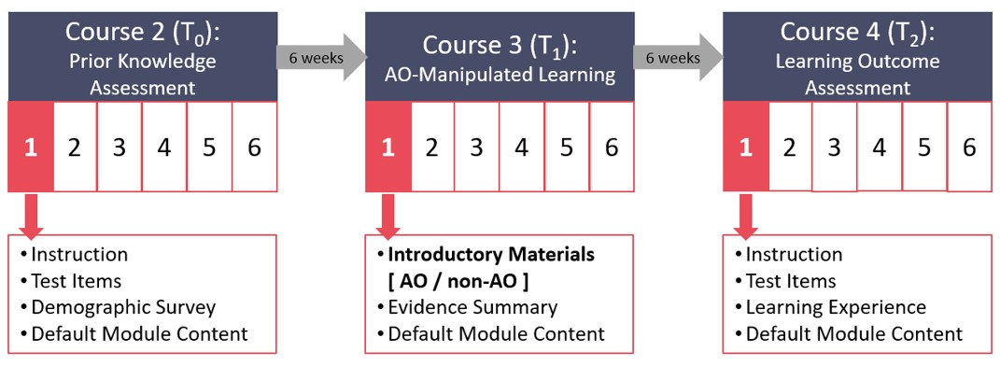

```{r setup, include=FALSE}
options(scipen = 999)
# empty work space
rm(list = ls())

# define directory
dir_step <- getwd()

# load libraries
library(tidyr)
library(dplyr)
library(ggplot2)
library(ggpubr)
library(mirt)

# load in functions
devtools::source_url("https://github.com/stefaniemeliss/AO_Project/blob/main/pilots/functions.R?raw=TRUE")

# function to determine outliers
is_outlier_iqr <- function(x) {
  # +/- 1.5*IQR
  return(x < quantile(x, 0.25, na.rm = T) - 1.5 * IQR(x, na.rm = T) | x > quantile(x, 0.75, na.rm = T) + 1.5 * IQR(x, na.rm = T))
}


```

### Study protocol




```{r, include=FALSE}
# --- Read in data --- #

# read in file that was past to LMS to determine grouptag
rand <- read.csv(file = file.path(dir_step, "npqll_random_group_assignment.csv"))

# read in data
pre <- read.csv(file = file.path(dir_step, "processed_data_course_2_module_1.csv"))
post <- read.csv(file = file.path(dir_step, "processed_data_course_4_module_1.csv"))
dt <- read.csv(file = file.path(dir_step, "processed_data_timestamps.csv"))

# merge ALL data
all <- merge(rand, pre, by = "user_id", all = T)
all <- merge(all, post, by = "user_id", all = T)
all <- merge(all, dt, by = "user_id", all = T)

# remove participants who provided non-responses in posttest free text items
all <- all %>% 
  filter(! user_id %in% c("US0czjy1n8wg", "USujo2jn-fwi"))

# merge complete data
df <- all[!is.na(all$score_posttest), ]

```

### Sample size

```{r, echo=FALSE, results='asis'}


cat("Data collection for the project closed on October 31st 2023 at 23:59. Up to this time point, we received N = ", nrow(pre), "responses to the prior knowledge test and N = ", nrow(post), "responses to the learning outcome assessment. ")
cat("There is complete data (i.e., pre- and post-test measures) from N = ", sum(post$user_id %in% pre$user_id), "participants. ")

cat("Upon careful inspection of the learning outcome assessment data, two participants were identified who provided non-responses in at least 14 out of 15 free-text items. Data from these two participants were excluded from the analyses. ")

# identify outliers: 1.5 * IQR
df$outlier_iqr_pretest <- is_outlier_iqr(df$score_pretest)
df$outlier_iqr_posttest <- is_outlier_iqr(df$score_posttest)
df$outlier_iqr <- ifelse(is.na(df$outlier_iqr_pretest) | is.na(df$outlier_iqr_posttest), NA,
                         ifelse(df$outlier_iqr_pretest| df$outlier_iqr_posttest, T, F))

# add to markdown
cat("Additionally, ", sum(df$outlier_iqr_posttest), "outliers were identified and removed.")

# remove outliers
df <- df[df$outlier_iqr_posttest == F, ]


cat("The sample analysed here consisted of N = ", nrow(df), "participants.\n\n")


```

> Data from other participants may be excluded upon receiving the engagement data.


### Descriptive characteristics

##### Prior knowledge assessment

To assess participants’ prior knowledge on the topic of the learning material (i.e., development of reading abilities), a 10-item four-alternative forced-choice test was developed. The scope of the prior knowledge assessment was for each item to target a different construct relevant to the development of reading abilities (e.g., “An orthography is…”). For each item, the correct answer (i.e., “The set of conventions associated with a written language.”) together with three plausible distractors (e.g., “The set of conventions associated with a phonics system.”) was presented. 

Participants were instructed to select the answer option that they think is correct and were encouraged to guess but discouraged from looking up the correct responses. The order of presentation of the ten items and corresponding distractors was randomised, and the same random order was applied across all participants. All items were presented on a single screen. Responses could only be submitted once each of the ten items has been completed. 

```{r, echo = F, results='asis', fig.align='center', warning=FALSE}
# define vars
var <- "score_pretest"
grp <- "group"

# generate and print descriptive tables to markdown
table_desc(data = df, group_var = grp, dep_var = var)    

# create rain cloud plot, adapted from: https://z3tt.github.io/Rainclouds/
plt <- plot_raincloud(data = df, xvar = grp, yvar = var, 
                      xlower = 1, xupper = 2,
                      ylower = 0, yupper = 10, ybreaks = 1,
                      #title = "Descriptive visualisation of rating in each group",
                      xlab = "Introductory material",
                      ylab = "Total number of correct items", 
                      note = "Error bars represent SE.")

# run two sample t-test
tmp <- t.test(df[, var] ~ df$group)

# extract values
t_val <- tmp$statistic
p_val <- tmp$p.value
df_val <- tmp$parameter

# add to markdown
if (p_val > 0.05) {
  cat("No significant difference in prior knowledge was found between the groups, t(", round(df_val, 2), ") = ", round(t_val, 2), ", p = ", round(p_val, 3), ".", sep = "")
} else {
  cat("A significant difference in prior knowledge was found between the groups, t(", round(df_val, 2), ") = ", round(t_val, 2), ", p = ", round(p_val, 3), ".", sep = "")
}


```


##### Learning outcome assessment

To determine whether exposure to an AO facilitates learning, an expert in the field (CS) developed a learning outcome assessment for the study. The learning outcome assessment targets information presented in the learning material. We created a set of 23 items capturing knowledge retention and transfer. The resulting learning outcome assessment consisted of 15 short answer items (e.g., “Complete this sentence: The smallest chunk of meaning within a word is called a __________.”) and 8 four-alternative forced-choice items. For each presented item (e.g., “Which of these are examples of comprehension strategies that might be used by pupils to support them to build meaning from a challenging text?”), participants were instructed to select all correct answers out of four alternatives they thought as correct (e.g., “Clarifying”, “Summarising”, “Highlighting”, “Blending”). 

For each of the short answer items (e.g., “Please complete the following sentence: With extensive practice, the process of word recognition develops a sense of flow. This flow of words is called __________.”), the correct solution was determined before the assessment was administered (e.g., “(reading) fluency”).  Additionally, all given answers were reviewed by a rater (CS) blind to the experimental condition and alternative acceptable solutions (e.g., “prosody”, “automaticity”) were identified. For each multiple-choice item with its four answer options, the pattern of selected/unselected options was compared against the correct pattern. This means that a point was awarded if an option was correctly selected and if an option was correctly not selected. However, due to an error, one multiple-choice item was set up to be a single-choice item, i.e., only one answer option could be selected. This item was scored as if it was a single item and a point was awarded if the correct answer was selected, but not if the incorrect answers were not selected. The maximum total score on the multiple-choice items was therefore 29. 

Participants were provided with matching instructions for each item type. Participants were informed that incorrect answers in the multiple-choice items will be penalised. Further, they were instructed to not look up responses. The order of presentation of the items (and corresponding distractors, in case of multiple-choice items) was randomised, and the same random order was be applied across all participants. All items will be presented on a single screen. Responses could only be submitted if each of the items has been completed. 

```{r, echo = F, results='asis', fig.align='center', warning=FALSE}
# define vars
var <- "score_posttest"
grp <- "group"

# generate and print descriptive tables to markdown
table_desc(data = df, group_var = grp, dep_var = var)    

# create rain cloud plot, adapted from: https://z3tt.github.io/Rainclouds/
plt <- plot_raincloud(data = df, xvar = grp, yvar = var, 
                      xlower = 1, xupper = 2,
                      #ylower = 15, yupper = 45, ybreaks = 1,
                      xlab = "Introductory material",
                      ylab = "Total number of points", 
                      note = "Error bars represent SE.")

```

##### Change in knowledge

To determine whether there was an overall change (i.e., increase) in knowledge, scores obtained in prior knowledge and learning outcome assessment were standardised and visualised in a spaghetti plot. The plot shows that while there is no overall increase in knowledge from pre- to post-test in either of the groups, the learning patterns are highly idiosyncratic: some participants improve, some worsen, some stay the same.  

```{r, echo = F, fig.align='center', warning=FALSE}
# standardise scores
df$score_pretest_c <- scale(df$score_pretest)
df$score_posttest_c <- scale(df$score_posttest)

# convert data into long format
df_l <- df %>% 
  select(user_id, group, score_pretest_c, score_posttest_c) %>%
  pivot_longer(cols = c("score_pretest_c", "score_posttest_c"),
               names_to = "timepoint", 
               values_to = "score_c")

df_l$timepoint <- ifelse(df_l$timepoint == "score_pretest_c", "Prior knowledge", "Learning outcome")
df_l$timepoint <- factor(df_l$timepoint, levels = c("Prior knowledge", "Learning outcome"))

# create a spaghetti plot
plt <- ggplot(data = df_l, aes(x = timepoint, y = score_c, group = user_id)) +
  geom_line(color = nondominant_col) +
  facet_wrap(. ~ group, nrow = 2) +
  stat_summary(fun="mean", geom = "point", col = dominant_col, group = 1) + 
  stat_summary(fun.data = mean_se, geom = "errorbar", width = .05, col = dominant_col, group = 1) +
  xlab("Assessment") + ylab("Standardised score") + labs(col = "Introductory material") +
  labs(caption = "Error bars represent SE.") +
  theme +
  theme(plot.caption = element_text(hjust=0))
plt

```


### Primary hypothesis test

Our primary hypothesis states that the exposure to an AO will improve the encoding of later presented, to-be-learned material. To test this hypothesis, an ANCOVA is used. We are interested in the main effect of experimental condition, i.e., whether an AO or historical overview, presented as introductory material, affects learning of the evidence summary (measured as the sum score of the learning outcome assessment), after controlling for prior knowledge at baseline (measured as the sum score of the prior knowledge assessment). The sum scores were standardised and the independent variable was dummy-coded (0 = "non-AO", 1 = "AO").  

```{r, echo = F, fig.align='center', warning=FALSE}

# effect code group
df$group_e <- ifelse(df$group == "AO", 1, 
                     ifelse(df$group == "non-AO", -1, NA))
# dummy code group
df$group_d <- ifelse(df$group == "AO", 1, 
                     ifelse(df$group == "non-AO", 0, NA))

```


An ANCOVA was run to determine the effect of introductory material on the learning outcome assessment score after controlling for prior knowledge assessment scores.

```{r, echo = F, results='asis', fig.align='center', warning=FALSE}

# determine the ANCOVA model
m1 <- lm(score_posttest_c ~ group_d + score_pretest_c, data = df)

# generate Ancova output
tmp <- car::Anova(m1, type = "III")

# extract coefficients - group effect
f_val <- tmp$`F value`[2]
p_val <- tmp$`Pr(>F)`[2]
numdf <- tmp$Df[2]
dendf <- tmp$Df[4]

# add to markdown - group effect
if (p_val > 0.05) {
  cat("After adjustment for prior knowledge assessment score, there was no statistically significant difference in learning outcome assessment score between the groups, F(", numdf, ", ", dendf, ") = ", round(f_val, 2), ", p = ", round(p_val, 3), ".", sep = "")
} else {
  cat("After adjustment for prior knowledge assessment score, there was a statistically significant difference in learning outcome assessment score between the groups, F(", numdf, ", ", dendf, ") = ", round(f_val, 2), ", p = ", round(p_val, 3), ".", sep = "")
}


# extract coefficients - covariate
f_val <- tmp$`F value`[3]
p_val <- tmp$`Pr(>F)`[3]
numdf <- tmp$Df[3]
dendf <- tmp$Df[4]

# add to markdown - covariate
if (p_val > 0.05) {
  cat("After adjustment for prior knowledge assessment score, there was no statistically significant difference in learning outcome assessment score between the groups, F(", numdf, ", ", dendf, ") = ", round(f_val, 2), ", p = ", round(p_val, 3), ".", sep = "")
} else {
  cat("After adjustment for prior knowledge assessment score, there was a statistically significant difference in learning outcome assessment score between the groups, F(", numdf, ", ", dendf, ") = ", round(f_val, 2), ", p = ", round(p_val, 3), ".", sep = "")
}
```

The results are summarised as type-III analysis-of-variance table below.
```{r, echo = F, results='asis', fig.align='center', warning=FALSE}
# lsr::etaSquared(m2) computes [partial] eta square
out <- merge(tmp, lsr::etaSquared(m1), by = 0, all.x = T)

out <- out[!out$Row.names == "(Intercept)", ] # remove intercept
out$Row.names <- c("AO effect", "Residuals", "Prior knowledge") # rename
out <- out[order(out$Row.names),]

print(knitr::kable(out))
cat('\n\n<!-- -->\n\n')


cat('\n\nAdditionally, the results were transformed into the OLS regression output.\n\n')
sjPlot::tab_model(m1, show.stat = T, show.fstat = T, show.df = T, pred.labels = c("Intercept", "AO effect", "Prior knowledge"))
cat('\n\n<!-- -->\n\n')


```

This indicates that our primary hypothesis - that exposure to an AO (compared to a control condition) during teacher professional development ahead of new, to-be-learned material will facilitate learning of the new material - could not be confirmed. The lack of effect of introductory material is further illustrated in the figure below, plotting the mean of the learning outcome assessment score in each group, adjusted for the prior knowledge effect.  

```{r, echo = F, results='asis', fig.align='center', warning=FALSE}
# define model with raw data for plotting
m <- lm(score_posttest ~ group + score_pretest, data = df)

# extract adjusted means and SE into df for plotting
adjusted_means <- effects::effect("group", m, se = T)

tmp <- data.frame(group = adjusted_means$variables$group$levels)
tmp$emm <- adjusted_means$fit
tmp$se <- adjusted_means$se


plt <- ggplot(data = tmp, aes(x = group, y = emm)) +
  geom_point(colour = dominant_col) +
  geom_errorbar(aes(ymin = emm - se, ymax = emm + se), width = .05, col = dominant_col) +
  coord_cartesian(ylim = c(min(df$score_posttest), max(df$score_posttest))) +
  xlab("Introductory material") + ylab("Adjusted mean learning outcome assessment") +
  labs(caption = "Error bars represent SE.") +
  theme +
  theme(plot.caption = element_text(hjust=0))
plt

```


### Learning experience survey

Upon completion of the learning assessment, participants were be asked to complete a short learning experience questionnaire (Wang et al., 2021).

> The type of learning material presented did not affect the learning experience ratings.

```{r, echo = F, results='asis', fig.align='center', warning=FALSE}

# define learning experience items
items <- c(
  "Overall, I was satisfied with the introductory material presented   ahead of the evidence summary in module 1 of course 3 ('Learning to read').",
  "Overall, I was satisfied with the evidence summary presented  in  module 1 of course 3 ('Learning to read').",
  "How much mental effort did you invest to learn the content from the introductory material   and evidence summary presented in module 1 of course 3 ('Learning to read')?",
  "How difficult was it for you to learn the content from the introductory material and evidence summary presented in module 1 of course 3 ('Learning to read')?"
)

anchors_low <- c(
  "Strongly disagree",
  "Strongly disagree",
  "Very, very low mental effort",
  "Very, very easy"
)

anchors_high <- c(
  "Strongly agree",
  "Strongly agree",
  "Very, very high mental effort",
  "Very, very difficult"
)


# define vars
vars <- c("sat_im_score", "sat_lm_score", "effort_score", "difficulty_score")
labels <- c("Satisfaction with introductory material",
            "Satisfaction with learning material",
            "Effort",
            "Difficulty")
grp <- "group"


for (v in 1:length(vars)) {
  
  var <- vars[v]
  
  # add header
  cat("#####", labels[v], "\n\n")
  
  cat("To assess ", tolower(labels[v]), ", participants were asked to rate the item '", items[v], "' on a 7-point Likert scale from 1 = '", anchors_low[v], "' to 7 = '", anchors_high[v], "'.\n\n", sep = "")
  
  
  # generate and print descriptive tables to markdown
  table_desc(data = df, group_var = grp, dep_var = var)    
  
  # create rain cloud plot, adapted from: https://z3tt.github.io/Rainclouds/
  plt <- plot_raincloud(data = df, xvar = grp, yvar = var, 
                        xlower = 1, xupper = 2,
                        ylower = 1, yupper = 7, ybreaks = 1,
                        #title = "Descriptive visualisation of rating in each group",
                        xlab = "Introductory material",
                        ylab = "Rating", 
                        note = "Error bars represent SE.")
  
  # run two sample t-test
  tmp <- t.test(df[, var] ~ df$group)
  
  # extract values
  t_val <- tmp$statistic
  p_val <- tmp$p.value
  df_val <- tmp$parameter
  
  
  # add to markdown
  if (p_val > 0.05) {
    cat("No significant difference in ", tolower(labels[v]), " was found between the groups, t(", round(df_val, 2), ") = ", round(t_val, 2), ", p = ", round(p_val, 3), ".\n\n", sep = "")
  } else {
    cat("A significant difference in ", tolower(labels[v]), " was found between the groups, t(", round(df_val, 2), ") = ", round(t_val, 2), ", p = ", round(p_val, 3), ".\n\n", sep = "")
  }
  
  
}

```